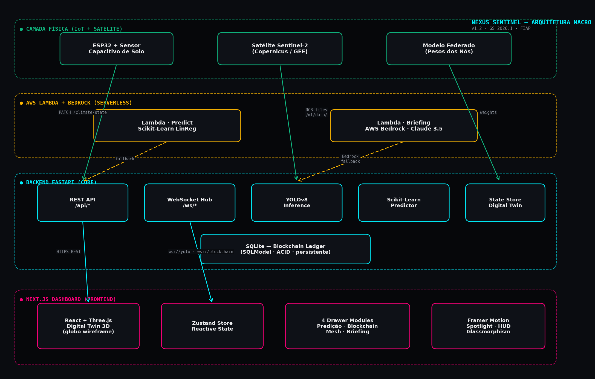

# FIAP - Faculdade de Informática e Administração Paulista

<p align="center">
<a href= "https://www.fiap.com.br/"></a>
</p>

<br>

# 🛰️ Nexus Sentinel

## Gêmeo Digital de Resiliência Climática Planetária

> **Global Solution 2026.1 — Economia Espacial & Impacto Positivo na Terra**


---

## 👥 Grupo Nexus — Integrantes

| Nome | RM |
|------|----|
| Miriã Leal Mantovani | RM567811 |
| João Pedro Santos Azevedo | RM566701 |
| Rodrigo de Souza Freitas | RM567100 |

---

<p align="center">
<b style="color: #FF007A; font-size: 1.5em;">⭐ QUERO CONCORRER ⭐</b>
</p>

---

## 🎯 Proposta

A pergunta da GS 2026.1 é direta: **como a Inteligência Artificial e as tecnologias digitais podem transformar a nova economia espacial e gerar impacto positivo na Terra?**

Nossa resposta é o **Nexus Sentinel** — uma plataforma de monitoramento climático global que materializa um **Gêmeo Digital** interativo da resiliência climática terrestre, integrando:

- **🛰️ Dados orbitais** — imagens RGB de Sentinel-2 (Copernicus/ESA) processadas via YOLOv8 para classificação de uso do solo (plantios, áreas degradadas, regeneração)
- **📡 IoT em campo** — ESP32 com sensor capacitivo de umidade do solo publicando leituras a cada 5 segundos
- **🧠 ML preditivo** — scikit-learn LinearRegression projetando escassez hídrica em 6 meses (R² 0.995, MAE 0.95)
- **☁️ Cloud serverless** — AWS Lambda + Amazon Bedrock (Claude 3.5 Sonnet) para briefings executivos automáticos em português
- **🌐 Aprendizado federado** — dados brutos nunca saem dos nós; apenas gradientes agregados trafegam (LGPD/GDPR compliant por construção)
- **⛓️ Blockchain ledger** — tokenização de ações de regeneração ambiental persistida em Postgres/SQLModel
- **🎨 Digital Twin 3D** — globo wireframe Three.js reativo, com WebSocket streaming a 60 FPS

---

## 🏛️ Arquitetura

O sistema segue **4 camadas verticais**, da física à interface, com fallback definido em cada uma:



| Camada | Componentes | Disciplina FIAP |
|--------|-------------|-----------------|
| **IoT / Satélite** | ESP32 (firmware MicroPython) + Sentinel-2 + Modelo Federado | IoT / ESP32 |
| **AWS Serverless** | Lambda Predict (sklearn) + Lambda Briefing (Bedrock) | Computação em Nuvem |
| **Backend FastAPI** | 8 REST + 2 WebSocket + YOLO + sklearn + Postgres | APIs / ML / Banco de Dados |
| **Frontend Next.js** | Globo 3D Three.js + Zustand + 4 drawers modulares | Front-end / Dashboards |

---

## 🚀 Quick Start

> Os comandos abaixo assumem que você está dentro desta pasta (`1TIAO/Global-Solution-2/`).

### 1. Backend (FastAPI)

```bash
cd src/backend
python -m venv venv && source venv/bin/activate
pip install -r requirements.txt
uvicorn main:app --reload --port 8000
```

- API: http://localhost:8000
- Swagger: http://localhost:8000/docs
- WebSockets: `ws://localhost:8000/ws/yolo` e `ws://localhost:8000/ws/blockchain`

### 2. Frontend (Next.js 15)

```bash
cd src/frontend
npm install
cp .env.example .env.local       # configurar NEXT_PUBLIC_USE_BACKEND=true
npm run dev
```

Acesse http://localhost:3000.

### 3. IoT (Simulador ESP32, opcional)

```bash
cd src/iot
pip install requests
python esp32_simulator.py --api https://nexus-sentinel-api-gpk9.onrender.com
```

A umidade do solo do dashboard começa a oscilar sozinha (ciclo dia/noite + ruído gaussiano).

### 4. ML — Treino YOLOv8 (opcional)

```bash
cd src/backend/ml
pip install -r requirements-ml.txt
python synthesize_dataset.py        # gera 240 imagens 640x640 sintéticas
python train.py --quick             # 10 épocas (~5min em CPU)
```

Reinicie o backend — o `yolo_service.py` auto-descobre os pesos e passa a fazer inferência real (caso contrário, mantém rotação de cenários mock).

### 5. AWS Lambda (opcional)

```bash
cd src/aws
sam build && sam deploy --guided
```

---

## 📁 Estrutura

```
Global-Solution-2/
├── README.md                          ← este arquivo
├── DEPLOY.md                          ← guia de deploy Vercel + Render + Neon
├── render.yaml                        ← Infrastructure as Code
├── docs/
│   ├── nexus-sentinel-gs-26-1.pdf     ← PDF de entrega (18 páginas)
│   └── gerar_pdf.py                   ← gerador automático via reportlab
├── assets/
│   ├── arq-macro.png                  ← arquitetura geral
│   ├── arq-fluxo-realtime.png         ← sequence diagram
│   └── arq-federated-learning.png     ← padrão federado
├── data/
│   ├── README.md                      ← documentação dos dados de referência
│   ├── samples/                       ← imagens de exemplo do YOLO
│   ├── transactions_seed.json         ← seed do ledger blockchain
│   └── climate_baseline.json          ← estado climático nominal
└── src/
    ├── frontend/                      ← Next.js 15 + TS + Tailwind + Framer + Three.js + Zustand
    ├── backend/                       ← FastAPI + SQLModel + WebSockets + sklearn + boto3
    │   ├── routers/                   ← 8 endpoints REST
    │   ├── services/                  ← yolo · prediction · blockchain · mesh · bedrock · state
    │   ├── ws/                        ← WebSocket hub
    │   └── ml/                        ← YOLOv8 training pipeline
    ├── iot/                           ← ESP32 simulator + firmware MicroPython
    │   ├── esp32_simulator.py
    │   ├── firmware/main.py
    │   └── wiring.md                  ← esquema elétrico + calibração ADC
    └── aws/                           ← AWS Lambda + SAM
        ├── lambda_predict/            ← scikit-learn como Lambda
        ├── lambda_briefing/           ← Bedrock + Claude 3.5
        └── template.yaml              ← SAM template
```

---

## 🧪 Integração entre Disciplinas

A solução integra praticamente todas as disciplinas trabalhadas durante o curso:

| Disciplina FIAP | Como aparece no projeto |
|-----------------|-------------------------|
| **Machine Learning** | scikit-learn LinearRegression com features polinomiais, holdout, R² 0.995 / MAE 0.95 |
| **Visão Computacional** | YOLOv8 (Ultralytics) + dataset sintético + pipeline de treino + auto-discovery de pesos |
| **APIs / Web Services** | 8 endpoints REST FastAPI + 2 canais WebSocket testados via TestClient |
| **IoT / ESP32** | Simulador Python + firmware MicroPython + esquema elétrico + calibração ADC 12-bit |
| **Computação em Nuvem** | 2 Lambdas Python (predict + briefing) deployáveis via AWS SAM |
| **Serviços Cognitivos** | Amazon Bedrock (Claude 3.5 Sonnet) para briefings executivos em português |
| **Banco de Dados** | Postgres (Neon) via SQLModel para persistência do ledger blockchain |
| **Front-end / UI** | Next.js 15 + Three.js (Digital Twin 3D) + Framer Motion + Zustand |
| **Dashboards** | Globo wireframe reativo · gráficos de tendência · terminal blockchain |
| **Análise de Dados em Tempo Real** | WebSocket streaming · 60 FPS Three.js · Postgres em produção |
| **Compliance / LGPD** | Aprendizado federado: dados brutos nunca saem dos nós locais |
| **DevOps / Engenharia de Software** | CI/CD automático Vercel + Render · Docker multi-stage · graceful degradation |

---

## 📊 Resultados Quantitativos

| Métrica | Valor | Validado por |
|---------|-------|--------------|
| R² do modelo de predição | 0.995 | sklearn holdout (6 meses) |
| MAE da predição | 0.95 pontos | sklearn holdout |
| Endpoints REST | 8 | TestClient (FastAPI) |
| Canais WebSocket | 2 | websockets lib |
| Funções AWS Lambda | 2 deployáveis | sam build + smoke test |
| Componentes React | 22 (.tsx) | find -name *.tsx |
| Linhas de código (front + back) | ≈ 3.900 | wc -l |
| Modos de degradação graceful | 5 camadas | AWS, WS, YOLO, LLM, cache |

---

## 🎬 Vídeo Demonstrativo

🔗 **YouTube (Não Listado):** https://youtu.be/8eqUow8rGTI

O vídeo demonstra causa→efeito do sistema em tempo real: estado nominal → aquecimento simulado (slider de temperatura) → acionamento de Aprendizado Federado → predição de escassez hídrica → briefing gerado pelo Bedrock → IoT publicando umidade ao vivo.

---

## 📄 PDF de Entrega

📑 **[`docs/nexus-sentinel-gs-26-1.pdf`](./docs/nexus-sentinel-gs-26-1.pdf)** — documento de 18 páginas com introdução, desenvolvimento técnico (10 subseções), resultados esperados, conclusões e referências. Gerado automaticamente a partir do código-fonte via reportlab.

Para regenerar:
```bash
pip install reportlab pypdf
python docs/gerar_pdf.py
```

---

## 🚀 Deploy Público — Sistema em Produção

O sistema está hospedado em arquitetura **serverless gratuita** (custo $0 perpétuo, sem cartão de crédito). Guia completo em [`DEPLOY.md`](./DEPLOY.md).

**Stack de produção:**
- 🌐 **Frontend** → Vercel (região São Paulo, edge CDN global)
- 🐍 **Backend** → Render (Docker free tier)
- 🗄️ **Postgres** → Neon (free perpétuo, sem expiração de 90 dias)
- ⏱️ **Uptime monitor** → UptimeRobot (ping a cada 5min, elimina cold start)
- ☁️ **Lambdas (opcional)** → AWS SAM

**URLs ativas:**

| Serviço | URL |
|---------|-----|
| 🌍 App ao vivo | https://nexus-sentinel-gs-2026-1.vercel.app |
| 🔌 API Backend | https://nexus-sentinel-api-gpk9.onrender.com |
| ❤️ Health check | https://nexus-sentinel-api-gpk9.onrender.com/health |
| 📖 Swagger Docs | https://nexus-sentinel-api-gpk9.onrender.com/docs |

---

## 🔄 Limitações e Próximos Passos

Como POC acadêmica, o sistema documenta honestamente suas limitações:

- O dataset YOLO atual é **sintético** (gerado por `synthesize_dataset.py`); produção exigiria treino com EuroSAT ou rótulos reais sobre tiles Sentinel-2.
- O **blockchain é simulado** (ledger Postgres); produção usaria Hyperledger ou contratos Ethereum.
- O **aprendizado federado é visualizado conceitualmente**; agregador real exigiria Flower ou TensorFlow Federated.

Roadmap para evolução pós-POC:
1. Substituir dataset sintético por imagens Sentinel-2 reais via `download_sentinel2.py`
2. Deploy completo do backend em AWS (Lambda + API Gateway + DynamoDB)
3. Integração com programas reais de carbon markets para tokenização efetiva
4. Hardware: 3-5 ESP32s em campo (SP, Brasília, fronteira agrícola)

---

## 📜 Licença

<p xmlns:cc="http://creativecommons.org/ns#" xmlns:dct="http://purl.org/dc/terms/"><a property="dct:title" rel="cc:attributionURL" href="https://github.com/agodoi/template">MODELO GIT FIAP</a> por <a rel="cc:attributionURL dct:creator" property="cc:attributionName" href="https://fiap.com.br">Fiap</a> está licenciado sob <a href="http://creativecommons.org/licenses/by/4.0/?ref=chooser-v1" target="_blank" rel="license noopener noreferrer" style="display:inline-block;">Attribution 4.0 International</a>.</p>

---

## 🙏 Agradecimentos

Às tutoras **Sabrina Otoni** e **Ana Cristina dos Santos** pelo acompanhamento durante o desenvolvimento das fases do curso. Os feedbacks construtivos foram essenciais para a evolução técnica do projeto.

---

<p align="center">
<i>Desenvolvido pelo <b>Grupo Nexus</b> · Global Solution 2026.1 · FIAP Graduação ON em Inteligência Artificial</i>
</p>