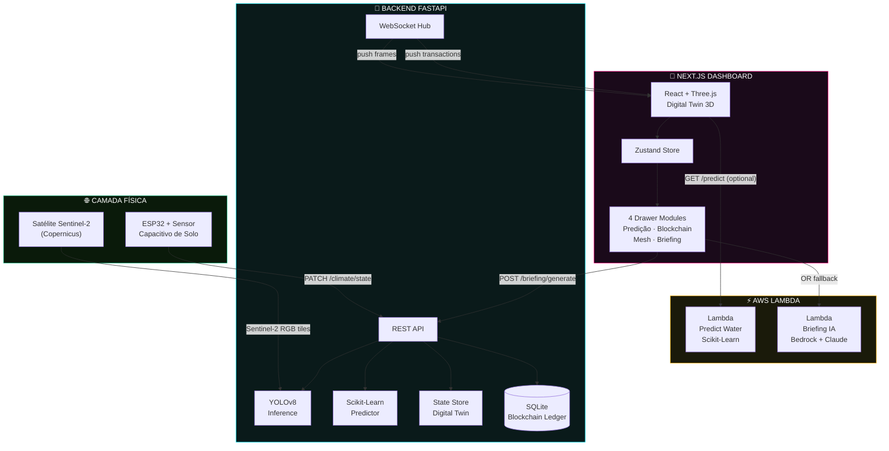
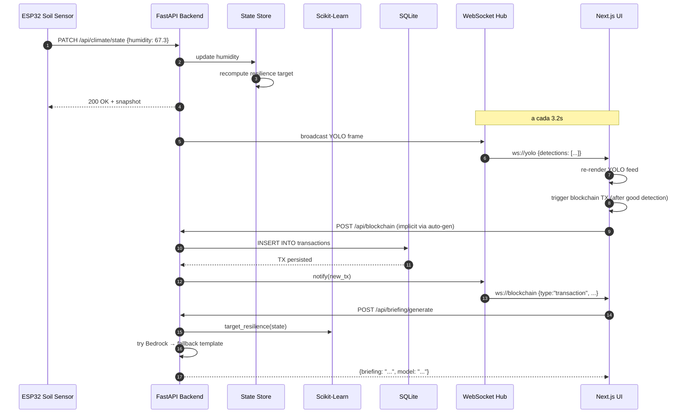
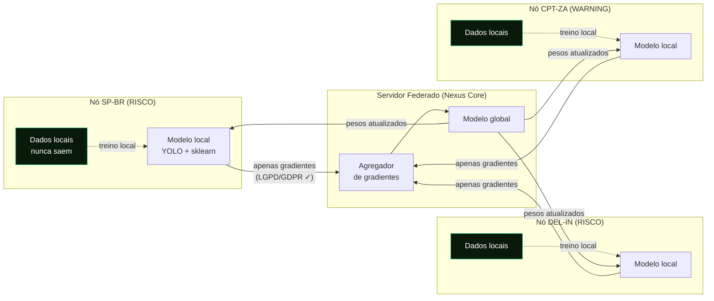

# Arquitetura — Nexus Sentinel

## Visão Macro

```mermaid
flowchart TB
    subgraph FIELD ["🌐 CAMADA FÍSICA"]
        ESP[ESP32 + Sensor<br/>Capacitivo de Solo]
        SAT["Satélite Sentinel-2<br/>(Copernicus)"]
    end

    subgraph EDGE ["⚡ AWS LAMBDA"]
        LP[Lambda<br/>Predict Water<br/>Scikit-Learn]
        LB[Lambda<br/>Briefing IA<br/>Bedrock + Claude]
    end

    subgraph CORE ["🧠 BACKEND FASTAPI"]
        API[REST API]
        WS[WebSocket Hub]
        YOLO[YOLOv8<br/>Inference]
        SKL[Scikit-Learn<br/>Predictor]
        STATE[State Store<br/>Digital Twin]
        DB[(SQLite<br/>Blockchain Ledger)]
    end

    subgraph FRONT ["🎨 NEXT.JS DASHBOARD"]
        UI[React + Three.js<br/>Digital Twin 3D]
        STORE[Zustand Store]
        DRAWERS[4 Drawer Modules<br/>Predição · Blockchain<br/>Mesh · Briefing]
    end

    ESP -->|PATCH /climate/state| API
    SAT -->|Sentinel-2 RGB tiles| YOLO

    API --> STATE
    API --> SKL
    API --> YOLO
    API --> DB

    WS -->|push frames| UI
    WS -->|push transactions| UI

    UI --> STORE
    STORE --> DRAWERS
    DRAWERS -->|"POST /briefing/generate"| API
    DRAWERS -->|"OR fallback"| LB
    UI -->|"GET /predict (optional)"| LP

    style FIELD fill:#0a1a0a,stroke:#10B981,color:#fff
    style EDGE fill:#1a1a0a,stroke:#FFB800,color:#fff
    style CORE fill:#0a1a1a,stroke:#00F2FF,color:#fff
    style FRONT fill:#1a0a1a,stroke:#FF007A,color:#fff
```

## Fluxo de Dados em Tempo Real

```mermaid
sequenceDiagram
    autonumber
    participant ESP as ESP32 Soil Sensor
    participant API as FastAPI Backend
    participant ST as State Store
    participant SKL as Scikit-Learn
    participant DB as SQLite
    participant WS as WebSocket Hub
    participant UI as Next.js UI

    ESP->>API: PATCH /api/climate/state {humidity: 67.3}
    API->>ST: update humidity
    ST->>ST: recompute resilience target
    API-->>ESP: 200 OK + snapshot

    Note over UI,WS: a cada 3.2s
    API->>WS: broadcast YOLO frame
    WS->>UI: ws://yolo {detections: [...]}
    UI->>UI: re-render YOLO feed
    UI->>UI: trigger blockchain TX (after good detection)

    UI->>API: POST /api/blockchain (implicit via auto-gen)
    API->>DB: INSERT INTO transactions
    DB-->>API: TX persisted
    API->>WS: notify(new_tx)
    WS->>UI: ws://blockchain {type:"transaction", ...}

    UI->>API: POST /api/briefing/generate
    API->>SKL: target_resilience(state)
    API->>API: try Bedrock → fallback template
    API-->>UI: {briefing: "...", model: "..."}
```

## Padrão de Aprendizado Federado

```mermaid
flowchart LR
    subgraph N1 ["Nó SP-BR (RISCO)"]
        D1[Dados locais<br/>nunca saem]
        M1[Modelo local<br/>YOLO + sklearn]
    end
    subgraph N2 ["Nó DEL-IN (RISCO)"]
        D2[Dados locais]
        M2[Modelo local]
    end
    subgraph N3 ["Nó CPT-ZA (WARNING)"]
        D3[Dados locais]
        M3[Modelo local]
    end
    subgraph AGG ["Servidor Federado (Nexus Core)"]
        AGGREGATOR[Agregador<br/>de gradientes]
        GLOBAL[Modelo global]
    end

    D1 -.->|treino local| M1
    D2 -.->|treino local| M2
    D3 -.->|treino local| M3

    M1 -->|"apenas gradientes<br/>(LGPD/GDPR ✓)"| AGGREGATOR
    M2 -->|"apenas gradientes"| AGGREGATOR
    M3 -->|"apenas gradientes"| AGGREGATOR

    AGGREGATOR --> GLOBAL
    GLOBAL -->|"pesos atualizados"| M1
    GLOBAL -->|"pesos atualizados"| M2
    GLOBAL -->|"pesos atualizados"| M3

    style D1 fill:#0a1a0a,stroke:#10B981,color:#fff
    style D2 fill:#0a1a0a,stroke:#10B981,color:#fff
    style D3 fill:#0a1a0a,stroke:#10B981,color:#fff
```
